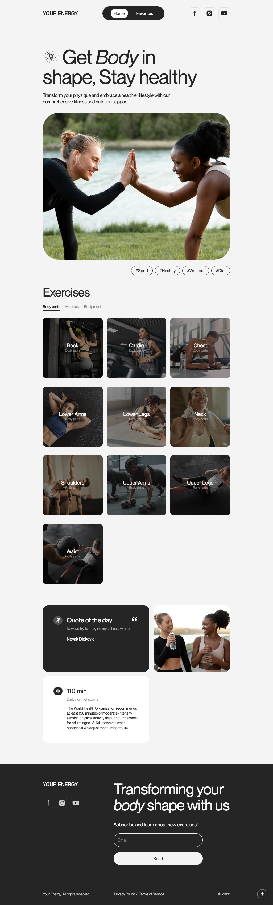

# Your Energy

"Your Energy" is a group project aimed at practicing HTML, CSS, and JS
practicing. It is a fitness app built using vanilla JavaScript, HTML, and CSS.

## Our team members

#### Scrum: [Ivan (Fa11enSky)](https://github.com/Fa11enSky) 😱

#### Team Lead: [Vladyslav (Boss)](https://github.com/direct66612) 🤨

#### Developers: [Vitaliy](https://github.com/Vitalii1973) 😜, [Tetiana](https://github.com/TaniaUdod) 😇, [Kateryna](https://github.com/Kateryna0715) 🥰, [Anton](https://github.com/chanchik96) 🙃, [Oleksii](https://github.com/yurichh) 😉, [Dmytro](https://github.com/Byshov92) 😎, [Denis](https://github.com/DenisGrabko) 😁, [Dmytro](https://github.com/DmitrFr) 🤫

## Live Demo

You can view the live demo of the "Your Energy" app
[here](https://direct66612.github.io/WebWarriors/).

## Project Overview

The "Your Energy" project is part of GoIT's Frontend/Fullstack learning program.
It consists of two main pages, `index.html` and `favorites.html`. The
`index.html` page serves as the home page where users can search for exercises
using GoIT Open Database API with filter they choose, and it displays the search
results and then by clicking on category Card user will see exercises Cards. The
`favorites.html` page displays the exercises that the user has added to their
favorite list, which are saved in the local storage of the browser.

## Requirements

The "Your Energy" project has the following requirements:

1. Two Pages: The project must have two pages - `index.html` and
   `favorites.html`.

2. Home Page: The `index.html` page serves as the search page where users can
   search for exercises using the GoIT Open Database API with the filter they
   choose, and it displays the results.

3. Add to Favorites: The `index.html` page must have a button that allows users
   to "add to favorites", which saves the exercise ID to the local storage of
   the browser.

4. Favorites Page: The `favorites.html` page loads and displays the exercises
   that the user has added to their wishlist from the local storage of the
   browser.

## Technologies Used

The "Your Energy" app is built using the following technologies:

- Vanilla JavaScript: For implementing the logic and functionality of the app.
- HTML: For structuring the web pages.
- CSS: For styling and layout.

## Features

The "Your Energy" app includes the following features:

1. Subscription Modal: When user enters the website modal appears after 10 secs
   suggesting the user to subscribe to learn more about new exercises.

2. Exercise Category Filter: Users can filter for categories by clicking on
   filter above Cards.

3. Click on Category to get exercises: The app displays search results,
   including exercise title, rating, and information about the workout.

4. Searchbar: When users are on exercises block, they can type in a searchbar to
   search for specific exercise. It will filter automatically.

5. Get detailed information: Users can click on Start button to get more
   detailed information about the exercise.

6. Add to Favorites: Users can add exercise to their favorite list by clicking
   the "Add to favorite".

7. Quote of the day: On a sidebar quote of the day changes everyday.

8. If users closed a pop-up modal they always can go to footer and subscribe to
   learn more about new exercises.

## Skills Acquired & Topics Researched

During the development of the "Your Energy" project, the following skills and
topics were acquired and researched:

1. REST API: Implementation of a RESTful API in JavaScript to fetch movie data
   from the OMDB API.

2. Asynchronous functions.

3. Custom pagination.

4. Using different libraries such as notiflix, lodash, axios.

5. Vite configuration for deployment on Github Pages.

6. Working in Team.
